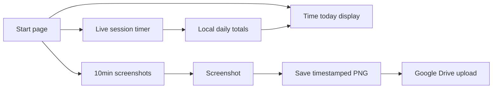

# Ubuntu Screen Tracker (Python)

## App overview doc (`APP.md`)

Create [`APP.md`](APP.md) at the project root with a short summary and a features section. Content to write:

```markdown
# Screen Tracker

## Summary
Screen Tracker is a simple Ubuntu desktop app that helps you track work time and keep a visual record of your screen. Click Start to begin a session, and the app counts your time, takes a screenshot every 10 minutes, and uploads each image to a shared Google Drive folder. Time today is shown on the start page so you can see how long you have tracked for the current day.

## Features

### Start / Stop tracking
One control window with Start and Stop. Tracking (timer + screenshots) runs only while a session is active.

### Session timer
From the moment you click Start, a live timer counts elapsed time in hours (for example `1h 05m 12s`). It stops when you click Stop.

### Time today
The start page shows total time tracked today. It includes finished sessions plus the current live session while tracking is on. Totals are saved locally so they remain after you close the app.

### Automatic screenshots
While tracking, the app captures the current screen once every 10 minutes.

### Timestamped filenames
Each screenshot is saved with the capture date and time in the filename (for example `2026-07-26_11-45-00.png`). No text is drawn on the image.

### Google Drive upload
Screenshots are uploaded to a configured Drive folder using a Google service account (JSON key). Share that folder with the service account email so uploads succeed.

### Status feedback
The UI shows session state and whether the last screenshot uploaded successfully or failed.
```

`README.md` remains the technical setup guide (venv, Drive credentials, run steps). `APP.md` is the product summary above.

## Decisions (confirmed)
- **Auth:** Google Drive **service account** JSON key → upload to a shared folder
- **Timestamp:** in the **filename only** (no watermark on the image)
- **Stack:** Python 3 + simple Tkinter window (Start / Stop)
- **Interval:** 1 screenshot every **10 minutes** while tracking is active
- **Timers:** live session timer from Start; **Time today** shown on the start page

## What the app does
1. Open a control window (start page) showing **Time today** and Start / Stop
2. On **Start**: begin a live session timer (counts up in hours, e.g. `0h 15m 32s` / `00:15:32`)
3. While running: every 10 minutes, capture the current screen
4. Save locally as e.g. `2026-07-26_11-45-00.png` and upload to Drive
5. On **Stop**: freeze session timer and add that duration to **today’s total**
6. Show status (last capture, upload ok/fail)



## Project layout
```
tracker-app/
  APP.md                  # product summary + features
  README.md               # setup / run guide
  requirements.txt
  .env.example
  config.py
  main.py                 # UI + start/stop lifecycle
  time_tracker.py         # session + daily totals persistence
  screenshot.py           # capture helpers
  uploader.py             # Drive service-account upload
  data/time_log.json      # gitignored — daily totals
  credentials/            # gitignored — service-account.json
```

## Implementation details

### Time tracking (`time_tracker.py`)
- **Session timer:** on Start, record `session_start`; UI updates every 1s with elapsed time formatted as hours (`Hh Mm Ss` or `H:MM:SS`)
- **Time today:** sum of completed sessions for the local calendar date + current live session while running
- **Persistence:** `data/time_log.json` shape:
  ```json
  {
    "2026-07-26": { "seconds": 5400 },
    "2026-07-25": { "seconds": 7200 }
  }
  ```
- On Stop (and on clean window close while running): add elapsed session seconds to today’s entry and clear the active session
- On app open: load today’s total and show it on the start page even before Start
- Midnight edge case: if a session crosses midnight, split seconds into yesterday vs today when stopping (simple date-key split)

### Screenshot (`screenshot.py`)
- Prefer `mss` (X11-friendly); fallback to `gnome-screenshot` / `import` if needed
- Filename format: `%Y-%m-%d_%H-%M-%S.png`
- Store under `./captures/` (gitignored), then upload

### Google Drive (`uploader.py`)
- Use `google-api-python-client` + `google-auth`
- Load service account from `.env` (`GOOGLE_SERVICE_ACCOUNT_FILE`)
- Target folder ID from `.env` (`GOOGLE_DRIVE_FOLDER_ID`)
- Upload PNG with the timestamped filename
- **README:** share the Drive folder with the service account `client_email` as Editor

### UI (`main.py`) — start page
- Prominent **Time today:** e.g. `Time today: 2h 30m`
- **Session:** live counter while tracking (`Session: 0h 15m 32s`); idle shows `Session: —` or `0h 0m 0s`
- Start / Stop buttons (Stop disabled until started)
- Status line: last screenshot / upload result
- `after(1000)` tick to refresh session + today displays
- Background thread for capture + upload so UI stays responsive
- On Start: start session clock; optional immediate first screenshot; then every 10 min
- On Stop / window close while running: stop scheduler, finalize session into today’s total

### Config
`.env.example`:
```
GOOGLE_SERVICE_ACCOUNT_FILE=credentials/service-account.json
GOOGLE_DRIVE_FOLDER_ID=your_folder_id_here
SCREENSHOT_INTERVAL_SECONDS=600
```

## Ubuntu setup (documented in README)
1. `python3 -m venv .venv && source .venv/bin/activate`
2. `pip install -r requirements.txt`
3. `sudo apt install python3-tk` (if needed)
4. Create GCP service account, enable Drive API, download JSON key
5. Share Drive folder with service account email; copy folder ID from URL
6. Copy `.env.example` → `.env` and fill values
7. Run: `python main.py`

## Dependencies
- `mss`, `Pillow` (capture/save)
- `google-api-python-client`, `google-auth`
- `python-dotenv`
- Tkinter (system: `python3-tk`)

## Out of scope (for v1)
- System tray / autostart on login
- Watermark overlay
- Multi-monitor picker
- OAuth / personal Google login
- Weekly/monthly history charts (only “today” + live session)
